## Hello World! 👋

  <picture>
    
  </picture>

- Undergraduate at ShanghaiTech University, advised by [Prof. Kewei Tu](https://faculty.sist.shanghaitech.edu.cn/faculty/tukw/). 
- Research interest: NLP / LLM / Speech / MLSys
- Also interested in Linguistics and Embedded Dev. 
- Member of ShanghaiTech's [GeekPie_ Association](https://github.com/ShanghaitechGeekPie/) and ACM Club.
- Served as Teaching Assistant in several courses.
- Learn more in [my homepage](lscoinred.github.io).

---

  <!-- GitHub Stats -->
  <picture>
    
  </picture>

  <!-- Top Languages -->
  <picture>
    
  </picture>

  <!-- Pac-Man -->
  <picture>
      <source media="(prefers-color-scheme: dark)" srcset="./profile/pacman-contribution-graph-dark.svg">
      <source media="(prefers-color-scheme: light)" srcset="./profile/pacman-contribution-graph.svg">
      
  </picture>

